<div align="center">

# 🛡️ Laboratorio de Seguridad de Red
### DMZ con FortiGate, segmentación por VLAN y hardening de switches


**Lisbeth Daian Gómez Soto · Matrícula 2025-0701**

</div>

---

## 🎬 Video demostrativo

> 📺 **[▶️ Ver el video de la demostración completa](https://TU-ENLACE-AL-VIDEO)**
>
> El video muestra, desde la GUI del FortiGate, el comportamiento de cada política: el bloqueo del Sistema de Inventario para la VLAN 10, el SSH exclusivo de la VLAN 20 y las restricciones de la DMZ.

---

## 📑 Tabla de contenido

1. [Propósito del laboratorio](#-propósito-del-laboratorio)
2. [Topología](#-topología)
3. [Plan de direccionamiento](#-plan-de-direccionamiento)
4. [Cumplimiento de requerimientos](#-cumplimiento-de-requerimientos)
5. [Configuración de los switches](#-configuración-de-los-switches)
6. [Configuración del FortiGate (GUI)](#-configuración-del-fortigate-gui)
7. [Configuración de los servidores](#-configuración-de-los-servidores)
8. [Pruebas y evidencias](#-pruebas-y-evidencias)
9. [Estructura del repositorio](#-estructura-del-repositorio)
10. [Cómo reproducir el laboratorio](#-cómo-reproducir-el-laboratorio)

---

## 🎯 Propósito del laboratorio

Este laboratorio implementa una infraestructura de red segura de dos zonas, usando un **FortiGate** como firewall perimetral y de segmentación:

- **Zona de usuarios:** dos VLAN (10 y 20) con direccionamiento por DHCP y políticas diferenciadas.
- **Zona DMZ:** tres servidores (Sistema de Caja, Sistema de Inventario y servidor de base de datos) aislados de la red LAN y sin acceso abierto a Internet.

Los objetivos de aprendizaje son:

| # | Objetivo |
|---|---|
| 1 | Diseñar una DMZ y aplicar políticas que impidan la fuga de tráfico hacia la LAN |
| 2 | Restringir la salida a Internet de los servidores a los endpoints de actualización necesarios |
| 3 | Limitar el acceso administrativo (SSH) a una sola VLAN |
| 4 | Bloquear el acceso de una VLAN a un servicio específico y mostrar al usuario la violación de política |
| 5 | Aplicar seguridad básica de capa 2 en los switches (VLAN, trunk, port-security, BPDU Guard, DHCP snooping) |
| 6 | Operar y demostrar todo el firewall por **GUI** |

---

## 🗺️ Topología

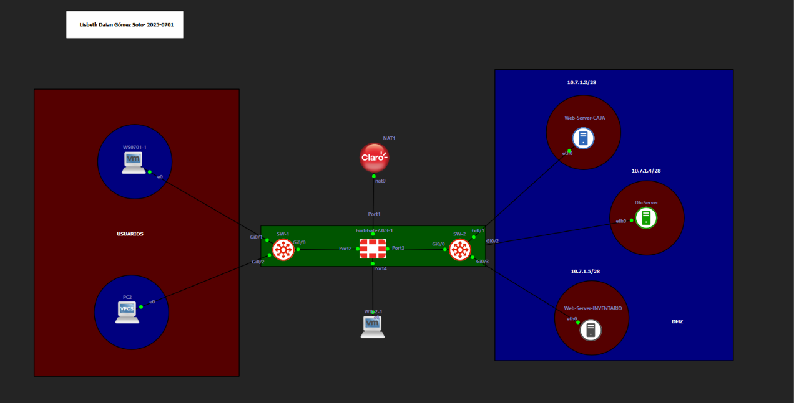

### Diagrama lógico

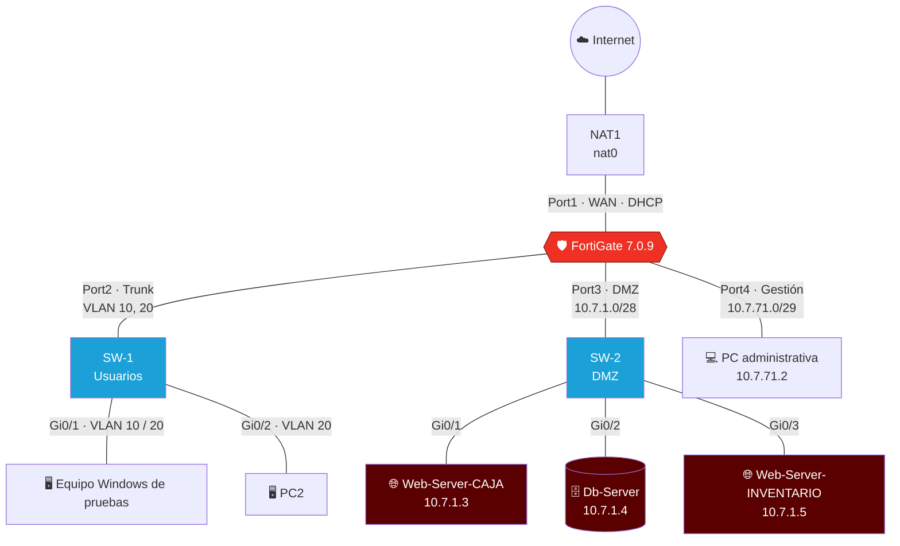
```mermaid
graph TD
    NET((☁️ Internet)) --- NAT["NAT1<br/>nat0"]
    NAT ---|"Port1 · WAN · DHCP"| FG{{"🛡️ FortiGate 7.0.9"}}

    FG ---|"Port2 · Trunk<br/>VLAN 10, 20"| SW1["SW-1<br/>Usuarios"]
    FG ---|"Port3 · DMZ<br/>10.7.1.0/28"| SW2["SW-2<br/>DMZ"]
    FG ---|"Port4 · Gestión<br/>10.7.71.0/29"| ADM["💻 PC administrativa<br/>10.7.71.2"]

    SW1 ---|"Gi0/1 · VLAN 10 / 20"| WS["🖥️ Equipo Windows de pruebas"]
    SW1 ---|"Gi0/2 · VLAN 20"| PC2["🖥️ PC2"]

    SW2 ---|"Gi0/1"| CAJA["🌐 Web-Server-CAJA<br/>10.7.1.3"]
    SW2 ---|"Gi0/2"| DB[("🗄️ Db-Server<br/>10.7.1.4")]
    SW2 ---|"Gi0/3"| INV["🌐 Web-Server-INVENTARIO<br/>10.7.1.5"]

    style FG fill:#EE3124,color:#fff,stroke:#8b1a12
    style SW1 fill:#1BA0D7,color:#fff
    style SW2 fill:#1BA0D7,color:#fff
    style CAJA fill:#5a0000,color:#fff
    style DB fill:#5a0000,color:#fff
    style INV fill:#5a0000,color:#fff
```

### Conexiones físicas

| Origen | Puerto | Destino | Puerto | Función |
|---|---|---|---|---|
| FortiGate | Port1 | NAT1 (nube NAT) | nat0 | WAN / Internet |
| FortiGate | Port2 | SW-1 | Gi0/0 | Trunk 802.1Q (VLAN 10 y 20) |
| FortiGate | Port3 | SW-2 | Gi0/0 | DMZ |
| FortiGate | Port4 | PC administrativa | e0 | Gestión por GUI |
| SW-1 | Gi0/1 | Equipo Windows de pruebas | e0 | Acceso VLAN 10 / VLAN 20 |
| SW-1 | Gi0/2 | PC2 | e0 | Acceso VLAN 20 |
| SW-2 | Gi0/1 | Web-Server-CAJA | eth0 | Acceso DMZ |
| SW-2 | Gi0/2 | Db-Server | eth0 | Acceso DMZ |
| SW-2 | Gi0/3 | Web-Server-INVENTARIO | eth0 | Acceso DMZ |

---

## 🔢 Plan de direccionamiento

Los rangos incorporan los dígitos de la matrícula **0701** (en el formato 7 y 1 de los octetos).

| Segmento | Red | Máscara | Gateway | Rango / Hosts |
|---|---|---|---|---|
| 🟠 **DMZ** (Port3) | `10.7.1.0/28` | 255.255.255.240 | `10.7.1.1` | Caja `.3` · Db `.4` · Inventario `.5` (estáticas) |
| 🔵 **VLAN 10** | `10.7.1.128/25` | 255.255.255.128 | `10.7.1.129` | DHCP `10.7.1.171 – 10.7.1.177` |
| 🟣 **VLAN 20** | `10.7.7.0/25` | 255.255.255.128 | `10.7.7.1` | DHCP `10.7.7.71 – 10.7.7.77` |
| ⚙️ **Gestión** (Port4) | `10.7.71.0/29` | 255.255.255.248 | `10.7.71.1` | PC administrativa `10.7.71.2` |
| 🌐 **WAN** (Port1) | Asignada por la nube NAT | — | — | DHCP + NAT |

### Servidores de la DMZ (/28)

| Servidor | IP | Puerto SW-2 | Servicios |
|---|---|---|---|
| Web-Server-CAJA | `10.7.1.3/28` | Gi0/1 | Apache (80), SSH (22) |
| Db-Server | `10.7.1.4/28` | Gi0/2 | MariaDB (3306), SSH (22) |
| Web-Server-INVENTARIO | `10.7.1.5/28` | Gi0/3 | Apache (80), SSH (22) |

---

## ✅ Cumplimiento de requerimientos

| Requerimiento | Implementación | Evidencia |
|---|---|---|
| Todo el firewall por GUI | Configuración y demostración desde la GUI del FortiGate | [Políticas](#políticas-de-firewall) |
| LAN de servidores en una DMZ | `Port3` con rol **DMZ** (`10.7.1.0/28`) | [Interfaces](#interfaces) |
| Evitar fuga hacia la LAN | Política `DMZ-DENY-ALL` (DENY de `Port3` hacia cualquier interfaz) | [Políticas](#políticas-de-firewall) |
| DMZ sin acceso abierto a Internet | Solo `HTTP/HTTPS` hacia `GRP-UPDATES`; el resto cae en `DMZ-DENY-ALL` | [Objetos](#objetos-de-direcciones) |
| Solo endpoints de actualización | Perfil Web Filter `WF-DMZ-UPDATES` (4 dominios en *Allow* + `*` en *Block*) | [Web Filter](#perfiles-de-web-filter) |
| SSH solo desde la VLAN 20 | `LAN20-SSH-DMZ` permite SSH; `LAN10-DENY-DMZ` lo niega a la VLAN 10 | [Pruebas SSH](#-pruebas-y-evidencias) |
| VLAN 10 sin acceso a Inventario | `LAN10-INV-BLOQUEADO` con perfil `WF-BLOQUEO-INV` y página de bloqueo | [Prueba de bloqueo](#-pruebas-y-evidencias) |
| 2 switches con VLAN | SW-1 (VLAN 10 y 20, trunk) y SW-2 (DMZ) | [Switches](#-configuración-de-los-switches) |
| Seguridad básica de red | Port-security, BPDU Guard, PortFast, DHCP snooping, puertos sin usar apagados | [Switches](#-configuración-de-los-switches) |
| 3 servidores en un /28 | Caja, Db e Inventario en `10.7.1.0/28` | [Servidores](#-configuración-de-los-servidores) |
| 2 usuarios en un /25 con DHCP | VLAN 10 y VLAN 20 en `/25`, rangos con los dígitos 0701 | [DHCP](#dhcp) |

---

## 🔌 Configuración de los switches

> Archivos completos: [`running-configs/SW-1_running-config.txt`](running-configs/SW-1_running-config.txt) · [`running-configs/SW-2_running-config.txt`](running-configs/SW-2_running-config.txt)
> Scripts de aplicación: [`scripts/switches/`](scripts/switches)

### Medidas de seguridad aplicadas

| Control | SW-1 | SW-2 |
|---|---|---|
| VLAN segmentadas | VLAN 10 y 20 | DMZ (VLAN 1 plana) |
| Trunk 802.1Q restringido | `allowed vlan 10,20` | — |
| `switchport nonegotiate` | ✅ | ✅ |
| PortFast + BPDU Guard en puertos de acceso | ✅ | ✅ |
| Port-security (sticky, máx. 1, shutdown) | Gi0/2 | Gi0/1, Gi0/2, Gi0/3 |
| DHCP snooping | VLAN 10 y 20 (trust en el trunk, límite de 15 pps) | — |
| Puertos sin usar apagados | ✅ | ✅ |

<details>
<summary><b>📄 Ver configuración de SW-1 (usuarios)</b></summary>

```cisco
hostname SW-1
!
vlan 10
 name USUARIOS-10
vlan 20
 name USUARIOS-20
!
ip dhcp snooping
ip dhcp snooping vlan 10,20
no ip dhcp snooping information option
!
interface GigabitEthernet0/0
 description TRUNK-FORTIGATE-PORT2
 switchport trunk encapsulation dot1q
 switchport trunk allowed vlan 10,20
 switchport mode trunk
 switchport nonegotiate
 ip dhcp snooping trust
!
interface GigabitEthernet0/2
 description PC2-VLAN20
 switchport access vlan 20
 switchport mode access
 switchport nonegotiate
 switchport port-security
 switchport port-security mac-address sticky
 spanning-tree portfast edge
 spanning-tree bpduguard enable
 ip dhcp snooping limit rate 15
```

</details>

<details>
<summary><b>📄 Ver configuración de SW-2 (DMZ)</b></summary>

```cisco
hostname SW-2
!
interface GigabitEthernet0/0
 description UPLINK-FORTIGATE-PORT3
 switchport mode access
 switchport nonegotiate
 spanning-tree portfast edge
 spanning-tree bpduguard enable
!
interface range GigabitEthernet0/1 - 3
 switchport mode access
 switchport nonegotiate
 switchport port-security
 switchport port-security mac-address sticky
 switchport port-security violation shutdown
 spanning-tree portfast edge
 spanning-tree bpduguard enable
```

</details>

### Verificación de SW-1

| VLAN creadas | Trunk hacia el FortiGate |
|:---:|:---:|
| 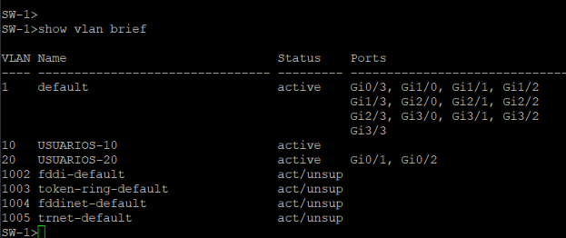 | 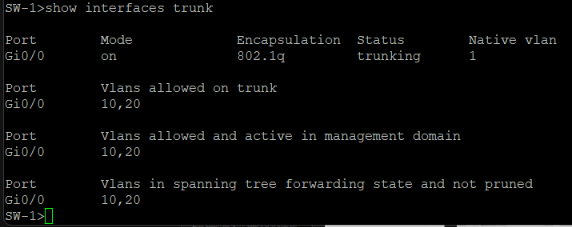 |
| `show vlan brief` | `show interfaces trunk` |

| Port-security | DHCP snooping |
|:---:|:---:|
| 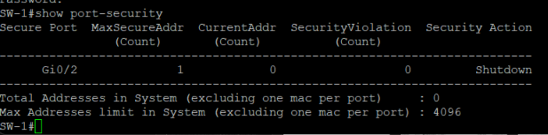 | 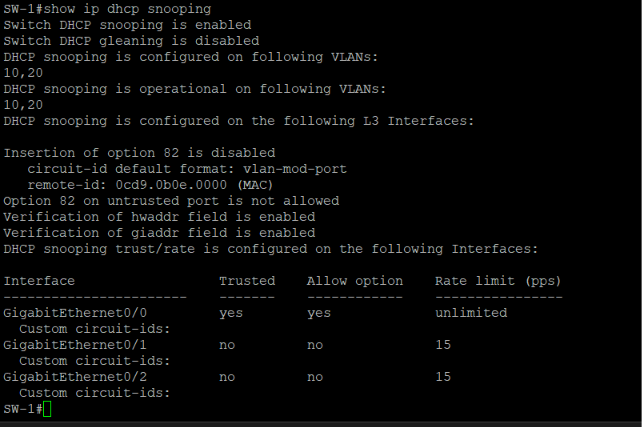 |
| `show port-security` | `show ip dhcp snooping` |

### Verificación de SW-2

| Port-security | Tabla MAC |
|:---:|:---:|
| 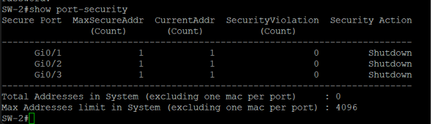 | 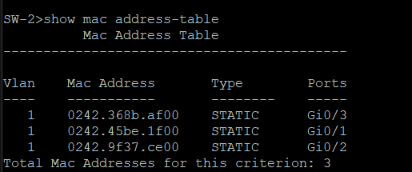 |
| Un servidor asegurado por puerto | Cada servidor en su puerto |

---

## 🛡️ Configuración del FortiGate (GUI)

> Configuración equivalente en CLI: [`running-configs/FortiGate_running-config.conf`](running-configs/FortiGate_running-config.conf)

### Interfaces

*Menú: **Network > Interfaces***

| Interfaz | Rol | Dirección | Acceso administrativo |
|---|---|---|---|
| `port1` | WAN | DHCP (nube NAT) | PING |
| `port2` | LAN | Sin IP (padre del trunk) | — |
| `VLAN10` (port2, ID 10) | LAN | `10.7.1.129/25` | — |
| `VLAN20` (port2, ID 20) | LAN | `10.7.7.1/25` | — |
| `port3` | **DMZ** | `10.7.1.1/28` | PING |
| `port4` | LAN | `10.7.71.1/29` | PING, HTTPS, SSH, HTTP |

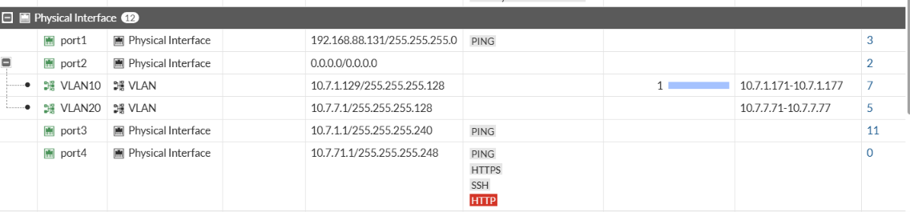

### DHCP

*Menú: **Network > Interfaces > VLAN10 / VLAN20 > DHCP Server***

| Interfaz | Rango | Gateway |
|---|---|---|
| VLAN10 | `10.7.1.171 – 10.7.1.177` | `10.7.1.129` |
| VLAN20 | `10.7.7.71 – 10.7.7.77` | `10.7.7.1` |

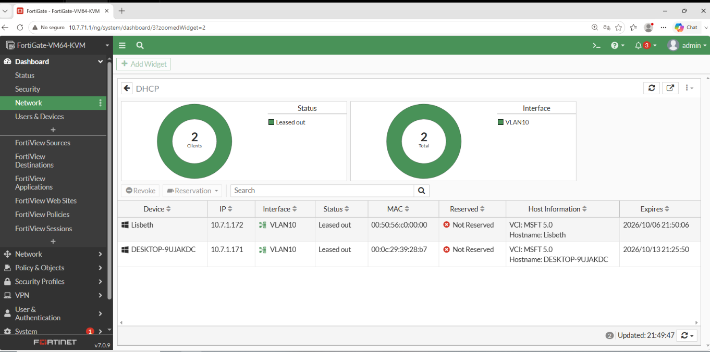

### DNS para la DMZ

*Menú: **Network > DNS Servers***

El FortiGate actúa como resolvedor recursivo en `port3`, de modo que los servidores usan `10.7.1.1` como DNS y no necesitan abrir el puerto 53 hacia Internet.

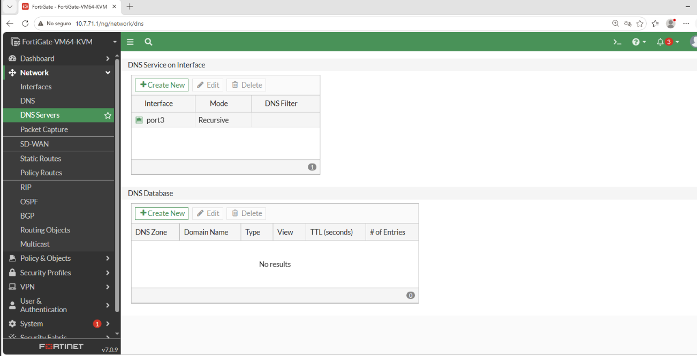

### Objetos de direcciones

*Menú: **Policy & Objects > Addresses***

| Nombre | Tipo | Valor |
|---|---|---|
| `NET-DMZ` | Subnet | `10.7.1.0/28` |
| `NET-VLAN10` | Subnet | `10.7.1.128/25` |
| `NET-VLAN20` | Subnet | `10.7.7.0/25` |
| `SRV-CAJA` | Subnet | `10.7.1.3/32` |
| `SRV-DB` | Subnet | `10.7.1.4/32` |
| `SRV-INV` | Subnet | `10.7.1.5/32` |
| `UPD-ubuntu-archive` | FQDN | `archive.ubuntu.com` |
| `UPD-ubuntu-security` | FQDN | `security.ubuntu.com` |
| `UPD-ubuntu-ports` | FQDN | `ports.ubuntu.com` |
| `UPD-mysql-repo` | FQDN | `repo.mysql.com` |
| `GRP-UPDATES` | Grupo | Los cuatro FQDN anteriores |

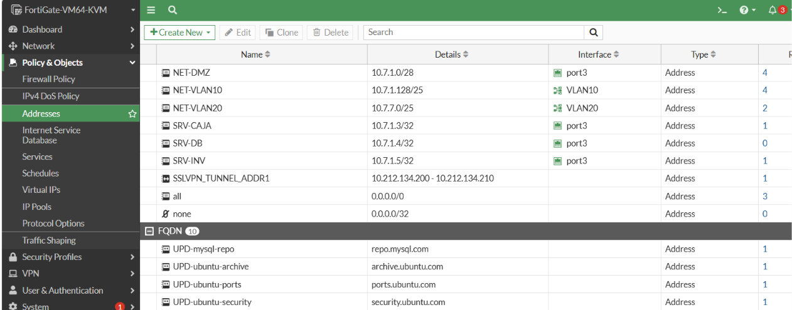

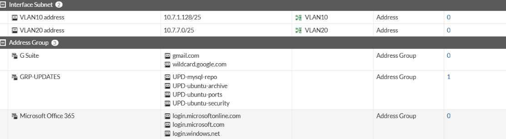

### Perfiles de Web Filter

*Menú: **Security Profiles > Web Filter***

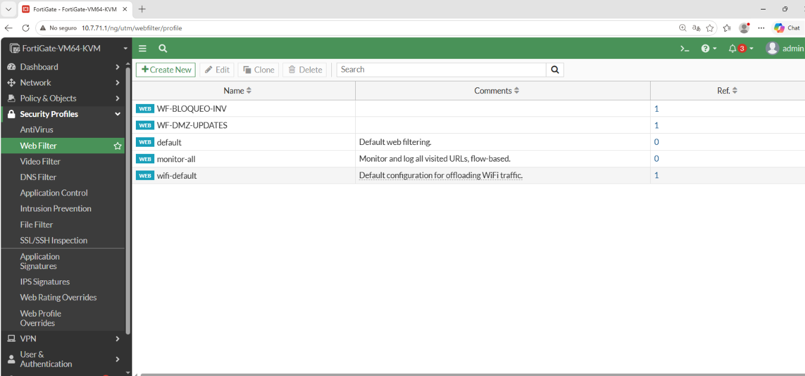

| Perfil | Función | Regla |
|---|---|---|
| `WF-BLOQUEO-INV` | Bloquea el acceso al Sistema de Inventario y muestra la página de violación de política | `10.7.1.5` · Simple · **Block** |
| `WF-DMZ-UPDATES` | Permite solo los endpoints de actualización | 4 dominios en **Allow** + `*` Wildcard en **Block** |

| WF-BLOQUEO-INV | WF-DMZ-UPDATES |
|:---:|:---:|
| 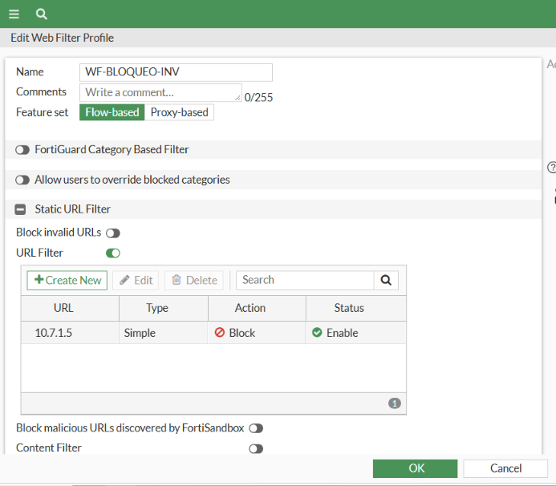 | 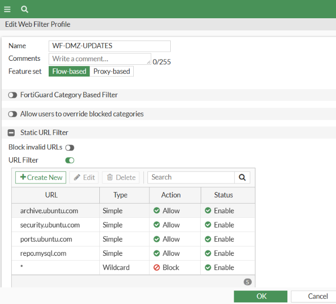 |

### Políticas de firewall

*Menú: **Policy & Objects > Firewall Policy** · el orden es relevante*

| # | Nombre | Origen → Destino | Servicio | Acción | NAT | Perfil |
|---|---|---|---|---|---|---|
| 1 | `LAN20-SSH-DMZ` | VLAN20 → `NET-DMZ` | SSH, HTTP, HTTPS | ✅ ACCEPT | No | — |
| 2 | `LAN10-WEB-CAJA` | VLAN10 → `SRV-CAJA` | HTTP, HTTPS | ✅ ACCEPT | No | — |
| 3 | `LAN10-INV-BLOQUEADO` | VLAN10 → `SRV-INV` | HTTP, HTTPS | ✅ ACCEPT | No | `WF-BLOQUEO-INV` |
| 4 | `LAN10-DENY-DMZ` | VLAN10 → `NET-DMZ` | ALL | ⛔ DENY | — | — |
| 5 | `DMZ-UPDATES-WAN` | DMZ → `GRP-UPDATES` (WAN) | HTTP, HTTPS | ✅ ACCEPT | Sí | `WF-DMZ-UPDATES` |
| 6 | `LAN-WAN-VLAN 10` | VLAN10 → WAN | ALL | ✅ ACCEPT | Sí | — |
| 7 | `DMZ-DENY-ALL` | DMZ → cualquier interfaz | ALL | ⛔ DENY | — | — |
| 8 | `LAN-WAN-VLAN20` | VLAN20 → WAN | ALL | ✅ ACCEPT | Sí | — |
| — | *Implicit Deny* | any → any | ALL | ⛔ DENY | — | — |

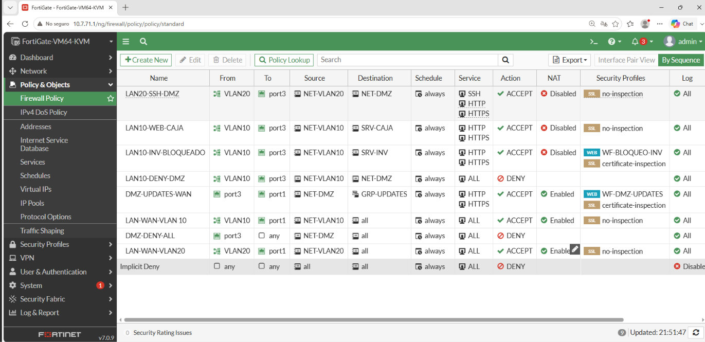

### Flujo de decisión del tráfico

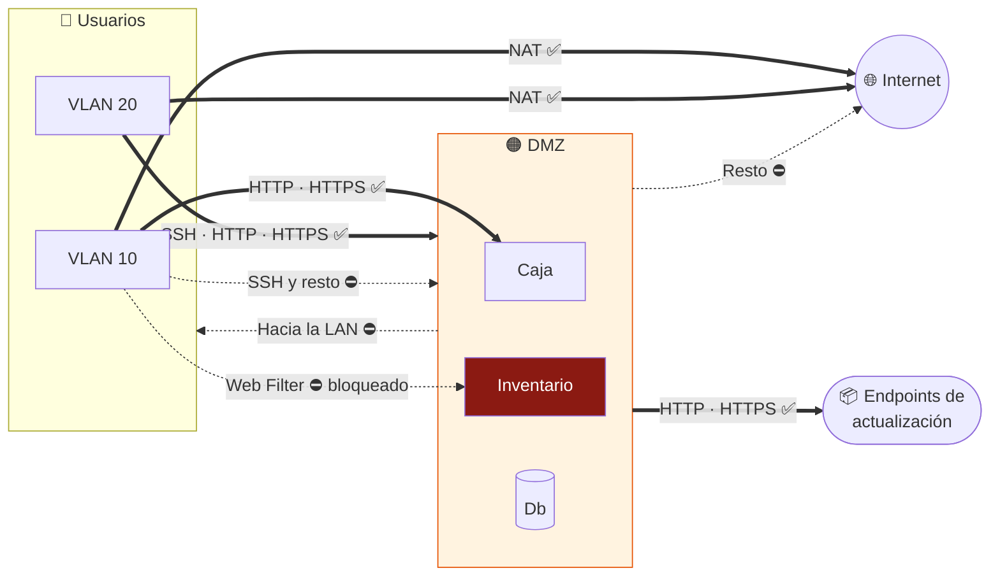
```mermaid
flowchart LR
    subgraph U["👥 Usuarios"]
        V10["VLAN 10"]
        V20["VLAN 20"]
    end
    subgraph D["🟠 DMZ"]
        CAJA["Caja"]
        INV["Inventario"]
        DB[("Db")]
    end
    NET(("🌐 Internet"))
    UPD(["📦 Endpoints de<br/>actualización"])

    V20 ==>|"SSH · HTTP · HTTPS ✅"| D
    V10 ==>|"HTTP · HTTPS ✅"| CAJA
    V10 -.->|"Web Filter ⛔ bloqueado"| INV
    V10 -.->|"SSH y resto ⛔"| D
    V10 ==>|"NAT ✅"| NET
    V20 ==>|"NAT ✅"| NET
    D ==>|"HTTP · HTTPS ✅"| UPD
    D -.->|"Resto ⛔"| NET
    D -.->|"Hacia la LAN ⛔"| U

    style INV fill:#8b1a12,color:#fff
    style D fill:#fff3e0,stroke:#e65100
```

### Secuencia: acceso de la VLAN 10 al Sistema de Inventario

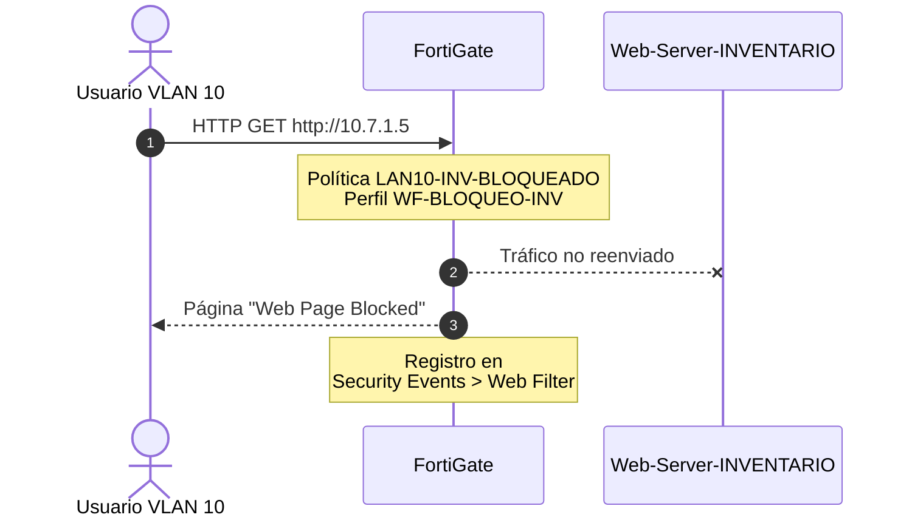
```mermaid
sequenceDiagram
    autonumber
    actor U as Usuario VLAN 10
    participant FG as FortiGate
    participant INV as Web-Server-INVENTARIO

    U->>FG: HTTP GET http://10.7.1.5
    Note over FG: Política LAN10-INV-BLOQUEADO<br/>Perfil WF-BLOQUEO-INV
    FG--xINV: Tráfico no reenviado
    FG-->>U: Página "Web Page Blocked"
    Note over FG: Registro en<br/>Security Events > Web Filter
```

---

## 🖥️ Configuración de los servidores

> Scripts: [`scripts/servidores/`](scripts/servidores)

| Servidor | Script | Qué configura |
|---|---|---|
| Web-Server-CAJA | [`caja.sh`](scripts/servidores/caja.sh) | IP, DNS, Apache con la página del sistema y SSH |
| Db-Server | [`db.sh`](scripts/servidores/db.sh) | IP, DNS, MariaDB y SSH |
| Web-Server-INVENTARIO | [`inventario.sh`](scripts/servidores/inventario.sh) | IP, DNS, Apache con la página del sistema y SSH |

Uso (dentro de cada servidor, como `root`):

```sh
sh caja.sh '<contraseña-de-root>'
```

Cada script:

1. Asigna la IP estática `/28`, el gateway `10.7.1.1` y el DNS `10.7.1.1`.
2. Actualiza el índice de paquetes (solo contra los endpoints permitidos por el firewall).
3. Instala y habilita los servicios del servidor.
4. Habilita el acceso SSH para `root` y establece la contraseña recibida como parámetro.

---

## 🧪 Pruebas y evidencias

Para la demostración se usa un equipo Windows conectado a `SW-1 Gi0/1`, que cambia de VLAN con un comando en el switch, y la PC administrativa conectada al `Port4` para mostrar la GUI del FortiGate en paralelo.

### 🔵 Pruebas desde la VLAN 10

| Prueba | Resultado esperado | Resultado |
|---|---|---|
| DHCP | IP entre `10.7.1.171` y `10.7.1.177` | ✅ |
| Sistema de Caja (`http://10.7.1.3`) | Carga | ✅ |
| Sistema de Inventario (`http://10.7.1.5`) | **Página de bloqueo** | ✅ |
| SSH a los servidores | **Bloqueado** | ✅ |

**DHCP y SSH bloqueado:** el equipo recibe `10.7.1.171` y la conexión SSH hacia la DMZ no se establece.

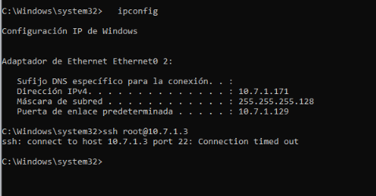

**Sistema de Caja accesible:**

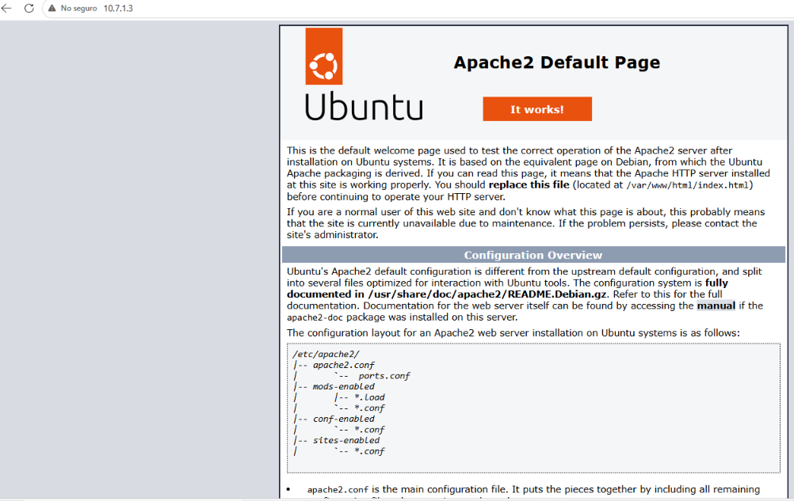

**Sistema de Inventario bloqueado:** el usuario ve que ha violado una política.

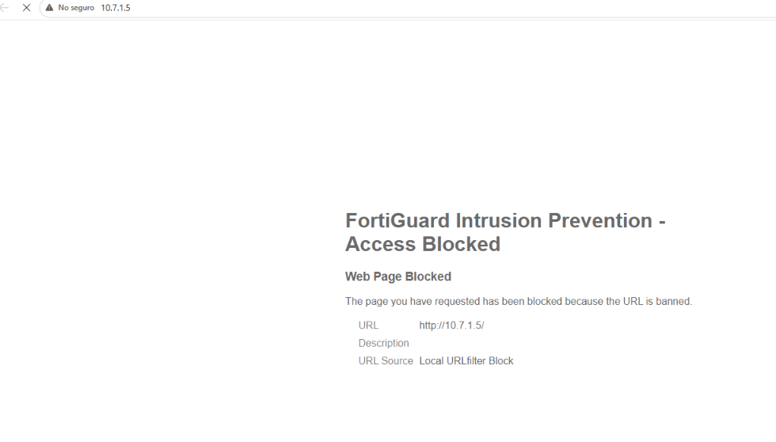

**Registros en el FortiGate**

| Web Filter (Security Events) | Forward Traffic |
|:---:|:---:|
| 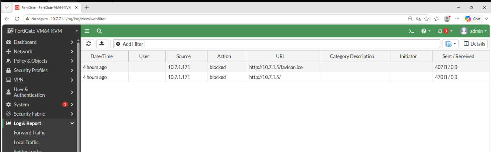 | 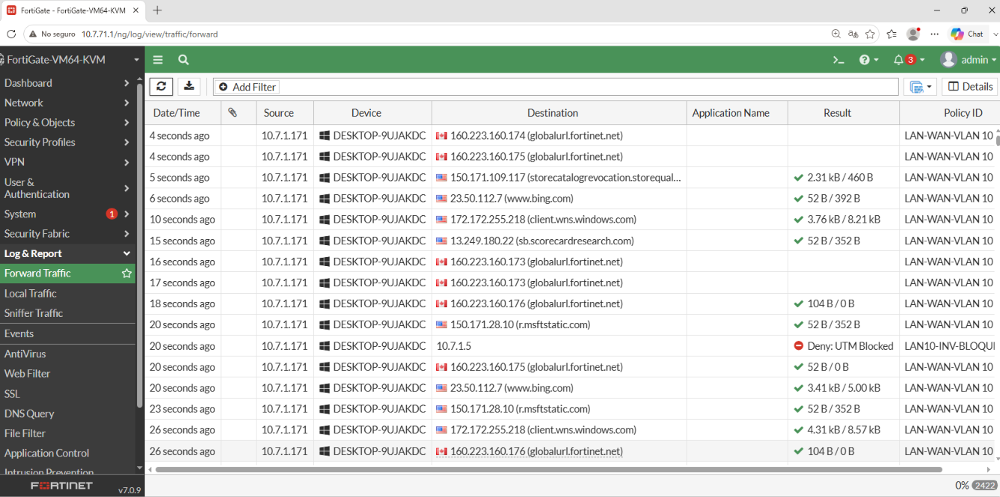 |
| Peticiones a `http://10.7.1.5` bloqueadas | `Deny: UTM Blocked` en `LAN10-INV-BLOQUEADO` |

### 🟣 Pruebas desde la VLAN 20

| Prueba | Resultado esperado | Resultado |
|---|---|---|
| DHCP | IP entre `10.7.7.71` y `10.7.7.77` | ✅ |
| Sistema de Inventario (`http://10.7.1.5`) | Carga | ✅ |
| SSH a Caja, Db e Inventario | **Permitido** | ✅ |

**Sistema de Inventario accesible:**

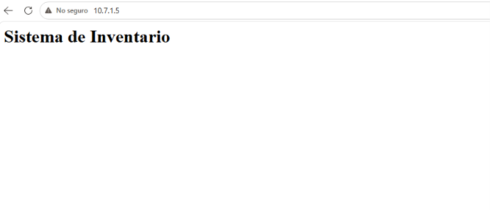

**SSH permitido a los tres servidores**

| Web-Server-CAJA | Web-Server-INVENTARIO | Db-Server |
|:---:|:---:|:---:|
| 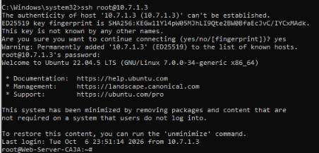 | 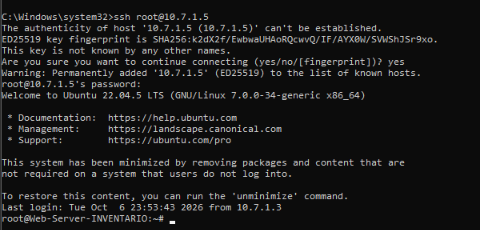 | 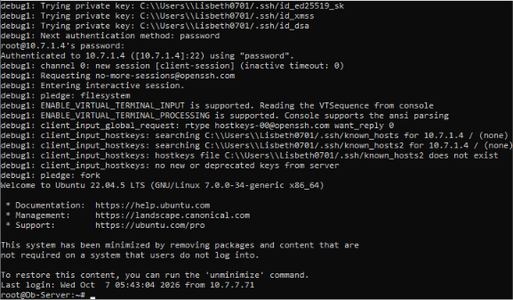 |

**Registro de tráfico de la VLAN 20:**

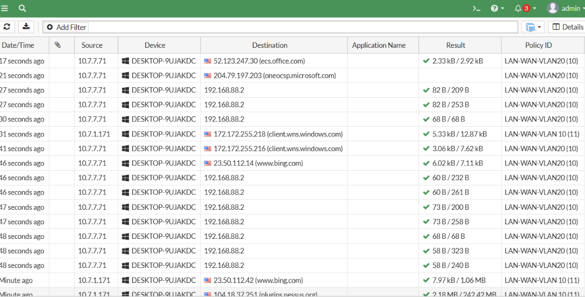

### 🟠 Pruebas desde la DMZ: sin acceso abierto a Internet

Los servidores de la DMZ solo pueden salir a los endpoints de actualización (`archive.ubuntu.com`, `security.ubuntu.com`, `ports.ubuntu.com` y `repo.mysql.com`). Cualquier otro destino, y todo tráfico hacia la LAN, queda bloqueado por la política `DMZ-DENY-ALL`.

| Prueba | Comando | Resultado esperado | Resultado |
|---|---|---|---|
| Actualizaciones permitidas | `apt update` | Descarga desde los endpoints permitidos | ✅ |
| Sitio de Internet | `wget -T 5 -t 1 -O /dev/null http://example.com` | Bloqueado | ✅ |
| Ping a Internet | `ping -c 3 8.8.8.8` | Sin respuesta | ✅ |
| Fuga hacia la LAN | `ping -c 3 10.7.1.171` y `ping -c 3 10.7.7.71` | Sin respuesta | ✅ |

**1. Actualizaciones permitidas:** el servidor descarga paquetes de los endpoints autorizados.

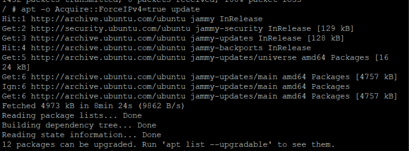

**2. Internet bloqueado:** el servidor no puede abrir un sitio externo ni hacer ping a Internet.

| Acceso web a Internet | Ping a Internet |
|:---:|:---:|
| 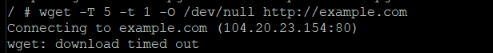 | 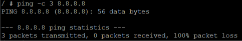 |
| `wget` termina en *download timed out* | 100 % de paquetes perdidos |

**3. Sin fuga hacia la LAN:** el servidor no alcanza las VLAN de usuarios.

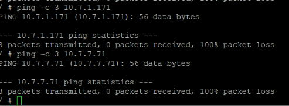

**4. Registros en el FortiGate:** el tráfico de actualización se permite (`DMZ-UPDATES-WAN`) y el resto se deniega (`DMZ-DENY-ALL`).

| Tráfico permitido | Tráfico denegado |
|:---:|:---:|
| 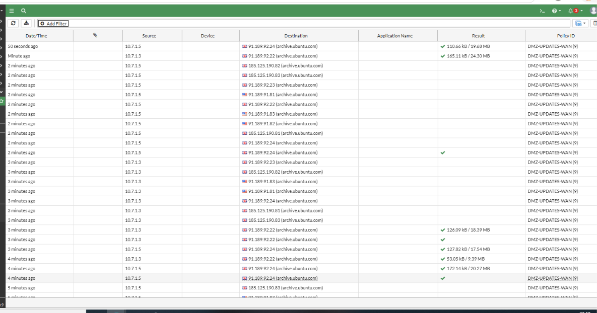 | 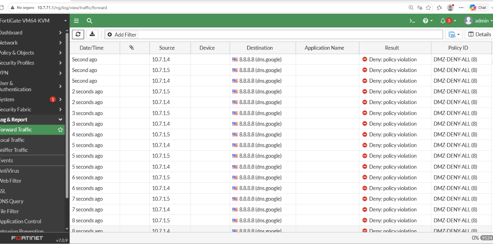 |
| Política `DMZ-UPDATES-WAN` | Política `DMZ-DENY-ALL` |

### 🔁 Cambiar el equipo de pruebas entre VLAN

```cisco
! Pasar a VLAN 20
configure terminal
interface GigabitEthernet0/1
 switchport access vlan 20
 shutdown
 no shutdown
 end
```

```cisco
! Volver a VLAN 10
configure terminal
interface GigabitEthernet0/1
 switchport access vlan 10
 shutdown
 no shutdown
 end
```

Después, en el equipo Windows: `ipconfig /release` y `ipconfig /renew`. Los scripts de la PC están en [`scripts/pc-windows/`](scripts/pc-windows).

---

## 📂 Estructura del repositorio

```
📦 repositorio
├── 📄 README.md                         ← Documentación principal
├── 🖼️ images/                           ← Capturas y evidencias
├── 📁 running-configs/
│   ├── SW-1_running-config.txt
│   ├── SW-2_running-config.txt
│   └── FortiGate_running-config.conf
└── 📁 scripts/
    ├── 📁 switches/
    │   ├── SW-1.txt
    │   └── SW-2.txt
    ├── 📁 servidores/
    │   ├── caja.sh
    │   ├── db.sh
    │   └── inventario.sh
    └── 📁 pc-windows/
        ├── ip-administrativa.bat
        └── ip-dhcp.bat
```

---

## 🚀 Cómo reproducir el laboratorio

1. **Montar la topología** en GNS3 según el [diagrama](#-topología): FortiGate VM 7.0.9, dos switches vIOS-L2, la nube NAT1, tres contenedores Ubuntu 22.04 y los equipos cliente.
2. **Switches:** pegar [`scripts/switches/SW-1.txt`](scripts/switches/SW-1.txt) y [`scripts/switches/SW-2.txt`](scripts/switches/SW-2.txt) en cada consola.
3. **Acceso inicial al FortiGate:** en la consola, asignar `10.7.71.1/29` a `port4` con acceso HTTPS. Desde ahí, todo se hace por GUI.
4. **PC administrativa:** ejecutar [`ip-administrativa.bat`](scripts/pc-windows/ip-administrativa.bat) y abrir `https://10.7.71.1`.
5. **FortiGate (GUI):** crear interfaces, DHCP, DNS, objetos, perfiles de Web Filter y políticas siguiendo las tablas de la [sección del FortiGate](#-configuración-del-fortigate-gui).
6. **Servidores:** ejecutar el script correspondiente en cada contenedor.
7. **Validar** con la sección de [pruebas](#-pruebas-y-evidencias).

---

<div align="center">

**Laboratorio de Seguridad de Red · Lisbeth Daian Gómez Soto · 2025-0701**

</div>
